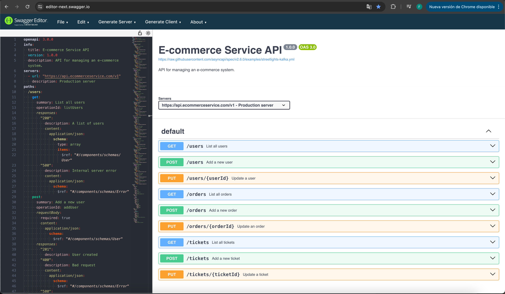
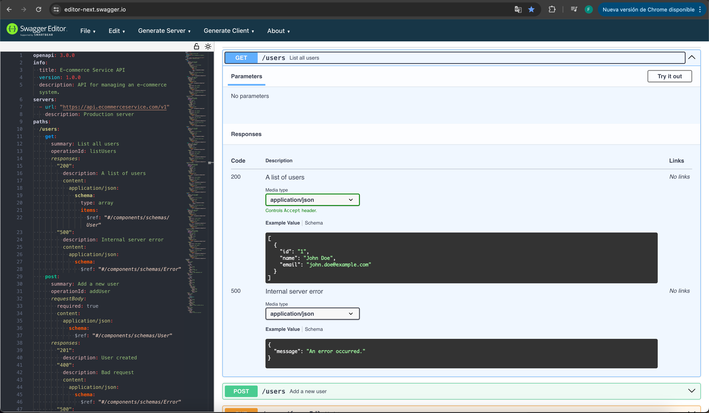

# Laboratorio 8
Laboratorio-Iron

# Taller de diseño y docuemntación de API

Entregables esperados:

* Documento de especificaciones API:
- Una especificación API SwaggerHub completa y detallada que incluye:
1. Descripciones de todos los puntos finales.
2. Definiciones de parámetros de solicitud y respuesta.
3. Modelos de recursos detallados.
4. Enumeración de posibles códigos de error y sus significados.

Problema:
Api donde se modele: perfiles de usuario, detalles de pedidos y tickets de clientes.

Solucion:

Para modelar la API, se pueden definir los siguientes puntos finales:


```yaml 
openapi: 3.0.0
        info:
        title: E-commerce Service API
        version: 1.0.0
        description: API for managing an e-commerce system.
        servers:
        - url: "https://api.ecommerceservice.com/v1"
        description: Production server
        paths:
        /users:
        get:
        summary: List all users
        operationId: listUsers
        responses:
        "200":
        description: A list of users
        content:
        application/json:
        schema:
        type: array
        items:
        $ref: "#/components/schemas/User"
        "500":
        description: Internal server error
        content:
        application/json:
        schema:
        $ref: "#/components/schemas/Error"
        post:
        summary: Add a new user
        operationId: addUser
        requestBody:
        required: true
        content:
        application/json:
        schema:
        $ref: "#/components/schemas/User"
        responses:
        "201":
        description: User created
        "400":
        description: Bad request
        content:
        application/json:
        schema:
        $ref: "#/components/schemas/Error"
        "500":
        description: Internal server error
        content:
        application/json:
        schema:
        $ref: "#/components/schemas/Error"
        /users/{userId}:
        put:
        summary: Update a user
        operationId: updateUser
        parameters:
        - name: userId
        in: path
        required: true
        schema:
        type: string
        requestBody:
        required: true
        content:
        application/json:
        schema:
        $ref: "#/components/schemas/User"
        responses:
        "200":
        description: User updated
        "400":
        description: Bad request
        content:
        application/json:
        schema:
        $ref: "#/components/schemas/Error"
        "404":
        description: User not found
        content:
        application/json:
        schema:
        $ref: "#/components/schemas/Error"
        "500":
        description: Internal server error
        content:
        application/json:
        schema:
        $ref: "#/components/schemas/Error"
        /orders:
        get:
        summary: List all orders
        operationId: listOrders
        responses:
        "200":
        description: A list of orders
        content:
        application/json:
        schema:
        type: array
        items:
        $ref: "#/components/schemas/Order"
        "500":
        description: Internal server error
        content:
        application/json:
        schema:
        $ref: "#/components/schemas/Error"
        post:
        summary: Add a new order
        operationId: addOrder
        requestBody:
        required: true
        content:
        application/json:
        schema:
        $ref: "#/components/schemas/Order"
        responses:
        "201":
        description: Order created
        "400":
        description: Bad request
        content:
        application/json:
        schema:
        $ref: "#/components/schemas/Error"
        "500":
        description: Internal server error
        content:
        application/json:
        schema:
        $ref: "#/components/schemas/Error"
        /orders/{orderId}:
        put:
        summary: Update an order
        operationId: updateOrder
        parameters:
        - name: orderId
        in: path
        required: true
        schema:
        type: string
        requestBody:
        required: true
        content:
        application/json:
        schema:
        $ref: "#/components/schemas/Order"
        responses:
        "200":
        description: Order updated
        "400":
        description: Bad request
        content:
        application/json:
        schema:
        $ref: "#/components/schemas/Error"
        "404":
        description: Order not found
        content:
        application/json:
        schema:
        $ref: "#/components/schemas/Error"
        "500":
        description: Internal server error
        content:
        application/json:
        schema:
        $ref: "#/components/schemas/Error"
        /tickets:
        get:
        summary: List all tickets
        operationId: listTickets
        responses:
        "200":
        description: A list of tickets
        content:
        application/json:
        schema:
        type: array
        items:
        $ref: "#/components/schemas/Ticket"
        "500":
        description: Internal server error
        content:
        application/json:
        schema:
        $ref: "#/components/schemas/Error"
        post:
        summary: Add a new ticket
        operationId: addTicket
        requestBody:
        required: true
        content:
        application/json:
        schema:
        $ref: "#/components/schemas/Ticket"
        responses:
        "201":
        description: Ticket created
        "400":
        description: Bad request
        content:
        application/json:
        schema:
        $ref: "#/components/schemas/Error"
        "500":
        description: Internal server error
        content:
        application/json:
        schema:
        $ref: "#/components/schemas/Error"
        /tickets/{ticketId}:
        put:
        summary: Update a ticket
        operationId: updateTicket
        parameters:
        - name: ticketId
        in: path
        required: true
        schema:
        type: string
        requestBody:
        required: true
        content:
        application/json:
        schema:
        $ref: "#/components/schemas/Ticket"
        responses:
        "200":
        description: Ticket updated
        "400":
        description: Bad request
        content:
        application/json:
        schema:
        $ref: "#/components/schemas/Error"
        "404":
        description: Ticket not found
        content:
        application/json:
        schema:
        $ref: "#/components/schemas/Error"
        "500":
        description: Internal server error
        content:
        application/json:
        schema:
        $ref: "#/components/schemas/Error"
        components:
        schemas:
        User:
        type: object
        required:
        - id
        - name
        properties:
        id:
        type: string
        example: "1"
        name:
        type: string
        example: "John Doe"
        email:
        type: string
        example: "john.doe@example.com"
        Order:
        type: object
        required:
        - id
        - userId
        - items
        properties:
        id:
        type: string
        example: "1"
        userId:
        type: string
        example: "1"
        items:
        type: array
        items:
        type: object
        properties:
        productId:
        type: string
        example: "1"
        quantity:
        type: integer
        example: 1
        Ticket:
        type: object
        required:
        - id
        - userId
        - description
        properties:
        id:
        type: string
        example: "1"
        userId:
        type: string
        example: "1"
        description:
        type: string
        example: "I have a problem with my order."
        Error:
        type: object
        required:
        - message
        properties:
        message:
        type: string
        example: "An error occurred."
```

Imagenes del diseño:




* Informe de reflexión:
- Un breve informe donde los participantes reflexionan sobre su proceso de diseño, discutiendo:
1. Los desafíos que enfrentaron durante el diseño de la API.

* Diseñar una API puede presentar varios desafíos, aquí te menciono algunos de los más comunes:  

- Definición clara de los endpoints: Los endpoints de una API deben ser intuitivos y consistentes para que los desarrolladores puedan entender fácilmente cómo interactuar con ellos.  
- Versionado: A medida que una API evoluciona, es importante tener una estrategia de versionado para evitar romper las aplicaciones existentes que utilizan la API.  
- Seguridad: Proteger la API de ataques malintencionados y garantizar que solo los usuarios autorizados tengan acceso a ciertos recursos puede ser un desafío.  
- Rendimiento: Diseñar una API que pueda manejar un gran número de solicitudes simultáneas sin degradar el rendimiento es crucial.  
- Documentación: Proporcionar documentación clara y completa es esencial para que los desarrolladores puedan utilizar la API de manera efectiva.  
- Pruebas: Asegurarse de que la API funciona como se espera bajo diferentes condiciones puede ser un desafío. Esto incluye la escritura de pruebas unitarias, de integración y de carga.  
- Mantenimiento y soporte: Una vez que la API está en uso, proporcionar soporte continuo y hacer frente a los problemas y solicitudes de los usuarios puede ser un desafío.  
- Compatibilidad y Deprecación: Mantener la compatibilidad con versiones anteriores mientras se introducen nuevas características y se deprecian las antiguas puede ser un desafío.

2. Cómo aplicaron los principios de API First para garantizar que la API fuera sólida y estuviera alineada con las necesidades comerciales.
   El enfoque de API First implica diseñar la API antes de comenzar a desarrollar el software que la utiliza. Este enfoque tiene varias ventajas que pueden ayudar a garantizar que la API sea sólida y esté alineada con las necesidades comerciales.

- . **Definición clara de los endpoints**: Al diseñar la API primero, puedes definir claramente los endpoints y cómo deben interactuar los clientes con ellos. Esto puede ayudar a evitar confusiones y errores más adelante.

- . **Facilita la colaboración**: Al tener una definición clara de la API desde el principio, los diferentes equipos (frontend, backend, mobile, etc.) pueden trabajar de manera más eficiente y coordinada.

- . **Permite la creación de mockups y pruebas tempranas**: Con la definición de la API, puedes crear mockups de la API para realizar pruebas incluso antes de que el backend esté completo. Esto puede ayudar a identificar y corregir problemas temprano en el proceso de desarrollo.

- . **Asegura la coherencia**: Al definir la API primero, puedes asegurarte de que la API sea coherente en términos de nomenclatura, estructura de datos, convenciones, etc. Esto puede hacer que la API sea más fácil de usar y mantener.

- . **Centrado en el usuario**: El enfoque de API First te obliga a pensar en los usuarios de la API (otros desarrolladores) desde el principio. Esto puede ayudarte a diseñar una API que sea fácil de entender y usar.


3. Información obtenida del ejercicio y posibles mejoras que podrían realizar en futuros proyectos de diseño de API.

