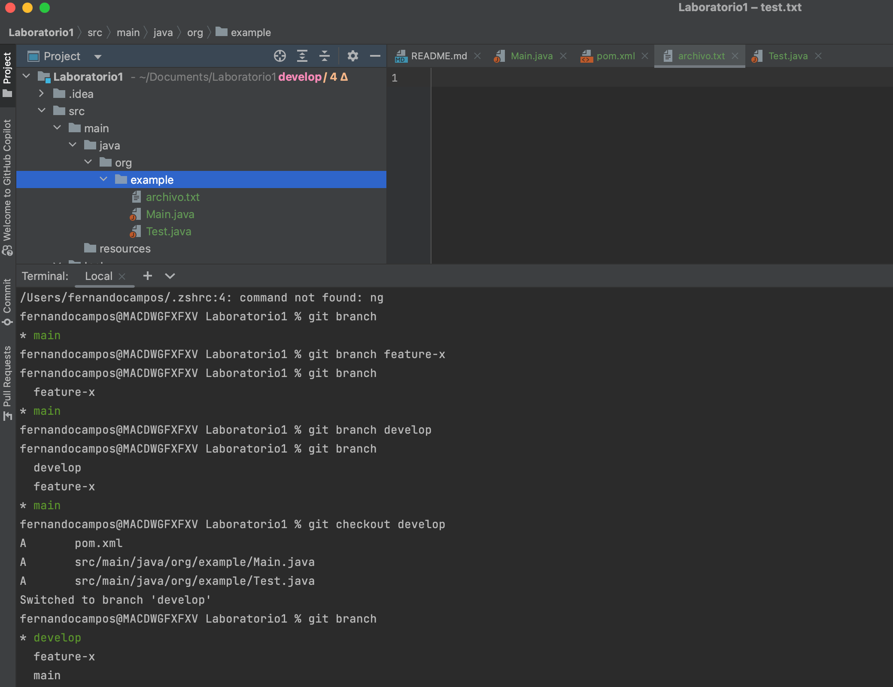
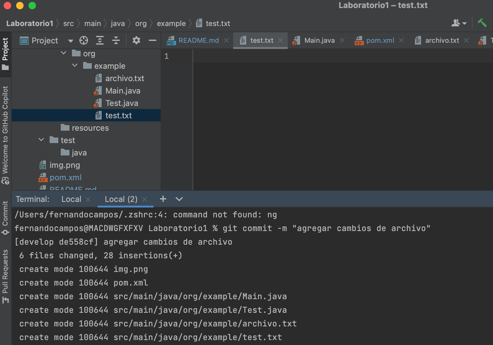
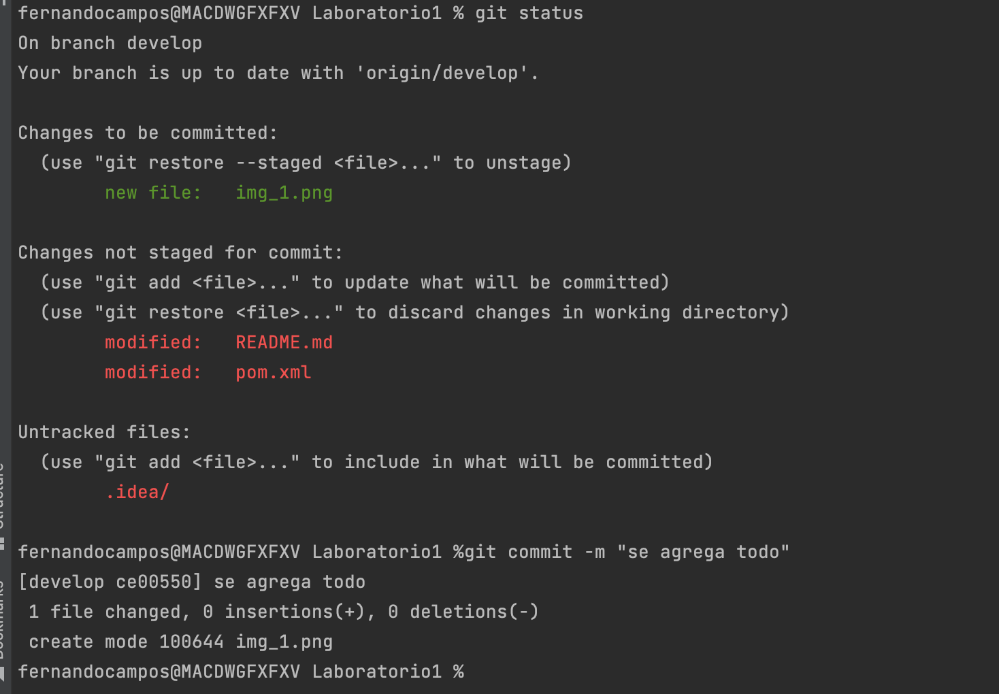
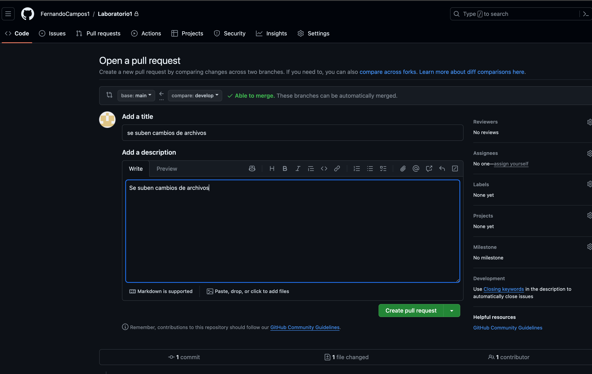
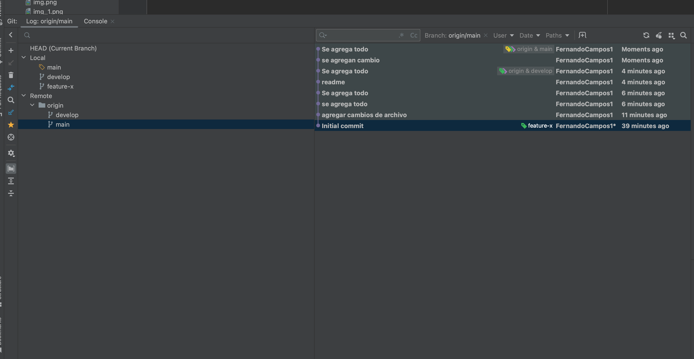
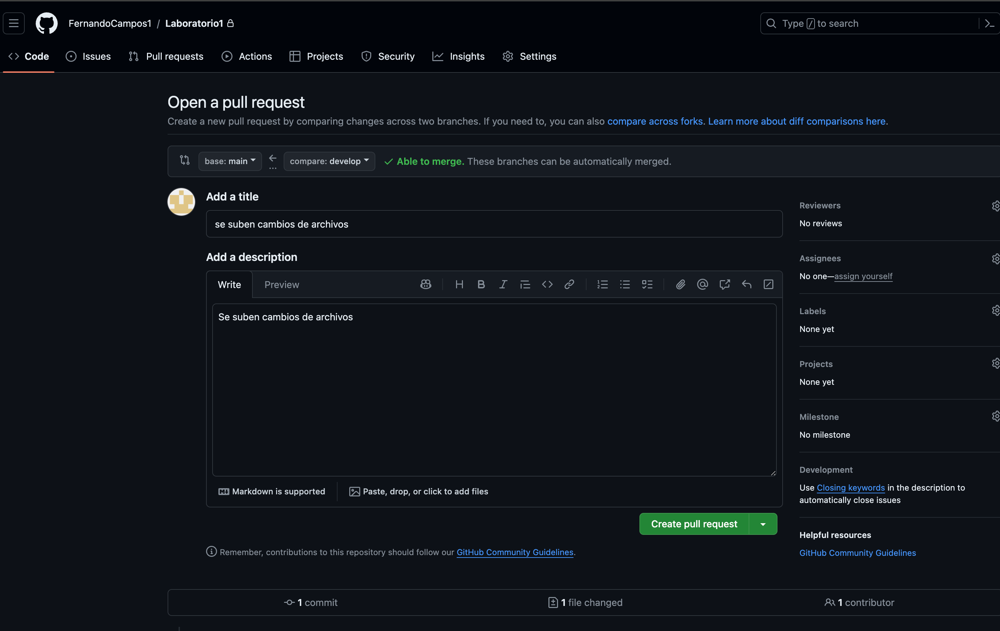
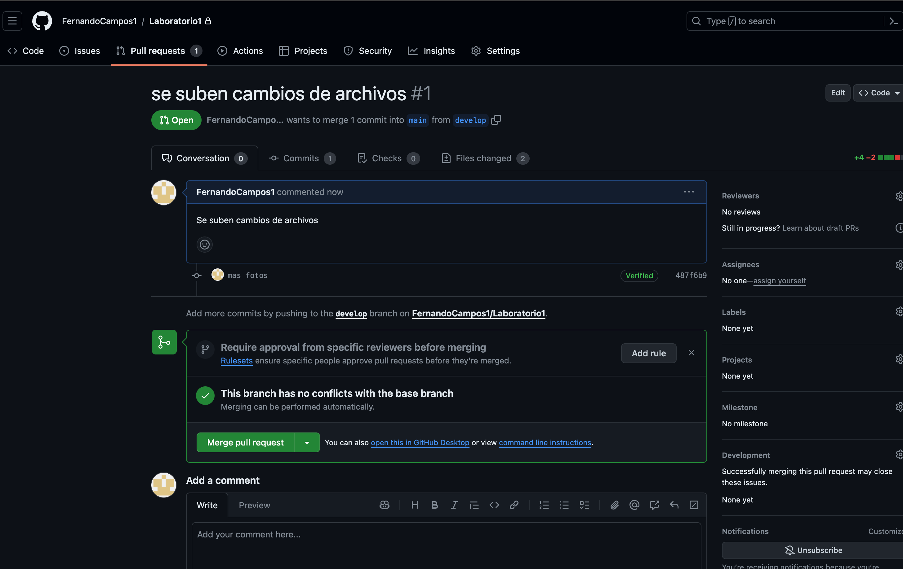
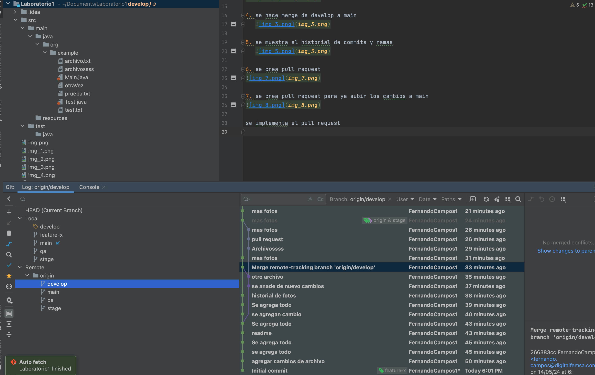
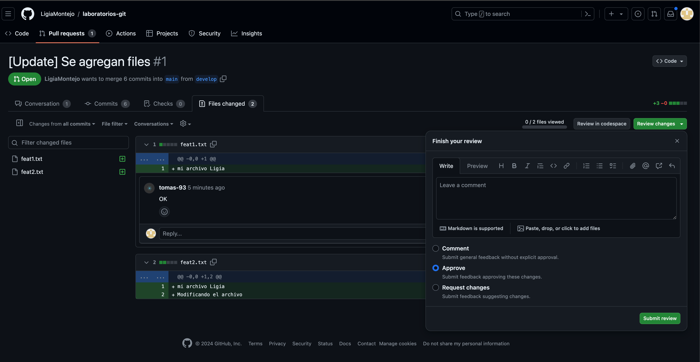

# Laboratorio1
Laboratorio-Iron

1. crear rama develop a aprtir de main
 

2. hacer commit

3. mas commits

4. se hace merge de develop a main
   

5. se muestra el historial de commits y ramas
   

6. se crea pull request

7. se crea pull request para ya subir los cambios a main

se implementa el pull request

imagenes de todos los ambientes:

aprobando pull request
